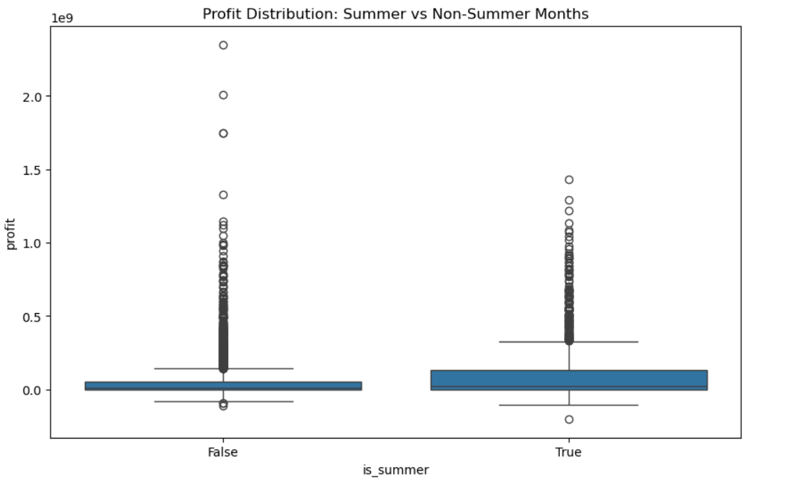

# Box Office Movies Analysis; EDA and Linear Regression Project


## Table of Contents
- [Project Overview](#project-overview)
- [Business Understanding](#business-understanding)
- [Objectives](#objectives)
  - [Main Objectives](#main-objectives)
  - [Specific Objectives](#specific-objectives)
- [Data Understanding](#data-understanding)
- [Exploratory Data Analysis (EDA)](#exploratory-data-analysis-eda)
- [Statistical Data Analysis (EDA)](#statistical-data-analysis)
- [Linear Regression Model](#linear-regression-model)
- [Installation](#installation)
- [Usage](#usage)
- [Results and Insights](#results-and-insights)
  - [Findings](#findings)
  - [Business Recomendations](#business-recommendations)
- [Contributors](#contributors)
- [Non Technical Presentation and Tableau Dashboard](#non-technical-presentation-and-tableau-dashboard)
- [License](#license)


## Project Overview
As the entertainment industry surges and major corporations dive into original video content, a new company is poised to enter the competitive world of movie-making. Recognizing the complexities of the film business, especially for newcomers, the company seeks to establish a strong foundation by understanding current box office trends and transforming these insights into a strategic roadmap for their new studio.

To ensure a successful start, the company has enlisted our help as Group 7 members to identify which types of films are currently performing well at the box office and translate these findings into actionable recommendations.

## Business Understanding
The Business objective is to identify which film genres will consistently bring in the most revenue for this new studio. There are many elements that contribute to a film's success and our goal is to analyze these factors through Exploratory Data Analysis (EDA) and linear regression. This will allow us to uncover trends and connections that will guide the studio's production choices.

Ultimately, we want to translate these insights into actionable recommendations that will help the studio create films that captivate audiences and turn a profit.

## Objectives

### Main Objectives
1.To determine which types of films are performing best at the box office.<br>
2.To identify key factors that contribute to a film's success.

### Specific Objectives
1.Investigate key variables such as production budgets, domestic and worldwide gross revenues, release years, and genres.<br>
2.Develop predictive models to determine factors significantly impacting box office performance.<br>
3.To investigate the relationship between production budget and box office revenue.<br>
4.To examine the impact of release timing on a film's success.<br>
5.To provide data-driven recommendations for film production and release strategies.<br>

## Data Understanding
This analysis, uses datasets from:

[IMD Data Base](https://www.imdb.com/)<br>
[Box Office](https://www.boxofficemojo.com/)<br>
[Rotten Tomatoes](https://www.rottentomatoes.com/)<br>
[The Movie](https://www.themoviedb.org/)<br>
[The Numbers](https://www.the-numbers.com/)<br>

The data contains information about various films, including their genres, budgets, box office revenues, movie ratings, and release dates.<br>
Understanding the structure and contents of our data will be the first step in uncovering the insights needed to guide our new movie studio's strategy.


## Exploratory Data Analysis (EDA)

The EDA section involves data cleaning, exploration, and visualization to uncover patterns and trends in the dataset. Key steps include handling missing values, encoding categorical variables, and visualizing distributions and relationships.
### Univariate Analysis

In the Univariate Analysis section, we focus on examining the statistical properties of individual
variables in our dataset. By analyzing one variable at a time, we can identify patterns, detect
outliers, and gain a clear understanding of each variable’s behavior, which is essential for accurate data interpretation and further analysis.
### Bivariate Analysis

The Bivariate Analysis section investigates the relationships between pairs of variables exploring
how the two variables interact with each other. This analysis helps us uncover associations, trends,
and dependencies that might exist between variables.

### Multivariate Analysis

In the Multivariate Analysis section, we extend our examination to more than two variables simultaneously.
This comprehensive approach provides deeper insights into the complex structure of our
data, helping us identify patterns, correlations, and underlying factors that are crucial for building
robust and accurate predictive models.

## Statistical Data Analysis

In this section, we apply statistical techniques to derive insights from our dataset. We use descriptive
statistics like mean, median, variance, and standard deviation to summarize the data’s central
tendency and dispersion. Inferential statistics, including hypothesis testing, confidence intervals,
and regression analysis, help us make predictions or generalizations about a population based on
our sample. This analysis will help validate our findings, identify significant patterns, and supports
data-driven decision-making.
### Hypothesis Testing
#### Test of Movies Released in Summer and Non-Summer
**Two Sample T-test**
Null Hypothesis (H0): There is no significant difference in movie profits between movies
released Summer and Non-Summer.
Alternative Hypothesis (H1): There is a significant difference in movie profits between
summer and non-summer months.


Based on the analysis the difference in movie profits between summer and non-summer months is statistically significant.
From the box plot, we can see that the box for summer movies (True) is slightly higher than for non-summer movies (False).
From both the t-test and the box plot visualisation we can infer that Movie profits tend to be high in the months of May, June and July (summer).

## Linear Regression Model
A linear regression model is created to predict box office revenue based on factors such as budget, genre, and release timing. The model is evaluated using metrics such as mean squared error and R-squared.

## Installation
To run this project, follow these steps:

1. Clone the repository:
    ```bash
    git clone https://github.com/yourusername/moviestudio-eda.git
    ```
2. Navigate to the project directory:
    ```bash
    cd moviestudio-eda
    ```
3. Install the required dependencies:
    ```bash
    pip install  requirements.txt
    ```

## Usage
Open the Jupyter notebook and follow the instructions to reproduce the analysis and results:

```bash
```
## Results and Insights 

### Findings
1. **Genre Ratings:**
Documentary and Drama genres have the highest median ratings, indicating they are
generally well-received.<br>
Horror and Action genres have lower median ratings, suggesting they might be less
favorably reviewed on average.<br>

2. **Production Budget vs. Profit:**
As the production budget increases, the profit tends to increase as well.<br>
High-budget productions are much less common.<br>

3. **Foreign vs. Domestic Gross:**
Most studios have a higher foreign gross, indicating a larger international market
presence.<br>
Buena Vista (Disney) leads in both domestic and foreign gross.<br>
Warner Bros and Universal show strong performances, with Warner Bros having a higher
foreign gross compared to domestic.<br>
STX Entertainment, Focus Features, and Weinstein Company have significantly lower
gross revenues, with both domestic and foreign gross below 1 billion.<br>

4. **Director Popularity:**
Steven Spielberg is the most popular director in the dataset.<br>
Barry Levinson and Ivan Reitman have the lowest frequencies among the top 10
directors.<br>

5. **Writer Frequency:**
Fyodor Dostoevsky and Jane Austen have the highest frequencies, indicating
they are the most frequently mentioned or analyzed writers in the dataset.<br>
William Golding and Philip Roth have the lowest frequencies among the top 10
writers.<br>

6. **Seasonal Profit Trends:**
May, June, and July have the highest average profits.<br>
January and February have the lowest average profits.<br>
December shows relatively high average profits, likely due to the holiday season
when people have more leisure time and are more likely to go to the movies.<br>

### Business Recommendations
1. **Focus on High-Earning Genres**: Prioritize producing films in genres that consistently show higher average ratings and box office returns, such as Drama, Comedy, and Documentary.

2. **Optimize Production Budgets**: Carefully balance production budgets to maximize profitability. Aim for a budget range that optimizes profitability without excessive spending, as higher budgets can lead to diminishing returns.

3. **Strategic Release Timing**: Schedule film releases during peak movie-going periods, such as summer and holiday seasons, to capitalize on higher average profits during these times.

4. **Invest in Proven Directors and Writers**: Collaborate with top directors and writers who have a track record of success. Their involvement can significantly impact a film’s success.

5. **Leverage Popular Franchises**: Consider developing or acquiring established film franchises, which often have built-in audiences, reducing marketing costs and increasing box office returns.

6. **Maximize Foreign Markets**: Ensure strong international distribution and marketing strategies, as significant revenue is generated from foreign markets.

7. **Quality Over Quantity**: Focus on producing a smaller number of high-quality films rather than a large number of lower-quality releases, as quality films can outperform in profitability and audience reception.

8. **Effective Use of Marketing Budgets**: Allocate sufficient budget for marketing to ensure high visibility and audience awareness. Successful films often have robust marketing campaigns that drive initial box office performance.

9. **Moderate Budget Allocations**: Recognize that even moderate budget allocations can yield significant profits. Ensure that budget allocations are strategically planned to optimize profit margins.

10. **Data-Driven Decision Making**: Continuously gather and analyze data on film performance, audience preferences, and market trends to inform strategic decisions and optimize resource allocation.

11. **Utilize Audience Feedback**: Implement mechanisms to gather audience feedback on film concepts and trailers to refine production choices and marketing strategies.

12. **Explore Niche Markets**: Investigate and target niche genres or themes that may have dedicated audiences but are currently underserved in the market.

13. **Collaborate with Streaming Platforms**: Consider partnerships with streaming services for exclusive releases or co-productions, tapping into their established audiences.

14. **Incorporate Diverse Storytelling**: Embrace diverse narratives and representation in films to attract a broader audience and resonate with various demographic groups.

15. **Leverage Social Media Marketing**: Utilize social media platforms for targeted marketing campaigns, engaging potential audiences through interactive content and promotions.

16. **Monitor Competitor Strategies**: Keep an eye on competitors’ successful films and strategies to identify trends and potential gaps in the market.

17. **Invest in Technology**: Explore advancements in film technology, such as virtual reality or augmented reality, to create unique viewing experiences that can attract audiences.

18. **Develop a Strong Brand Identity**: Establish a clear brand identity for the studio that resonates with target audiences and differentiates it from competitors.

19. **Create a Robust Distribution Network**: Build relationships with distributors to ensure films reach a wide audience both domestically and internationally.

20. **Evaluate Performance Metrics**: Regularly assess the performance of released films using metrics such as ROI, audience ratings, and critical reviews to refine future production strategies.

## Non Technical Presentation and Tableau Dashboard
Find the links to our [Non Technical Presentation](https://www.canva.com/design/DAGMP4zliSY/GVwfZ1H0bum8bmu1hTkfQg/view?utm_content=DAGMP4zliSY&utm_campaign=designshare&utm_medium=link&utm_source=editor#20) and [Tableau Dashboard](https://public.tableau.com/app/profile/kelvin.letimalo/viz/project2_17221954338640/Dashboard1?publish=yes)

## Contributors
1. Gladwell  Chepkorir
2. Isaac 	Ngugi
3. Monica 	Anyango
4. Kelvin	Letimalo
5. Kezia Neema

## License
